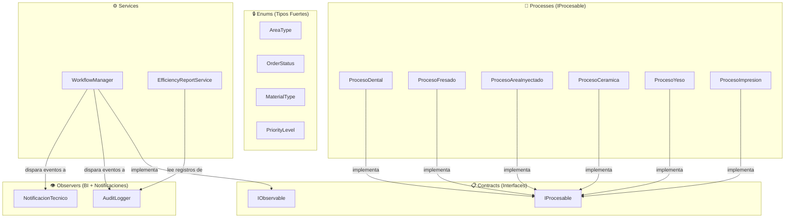
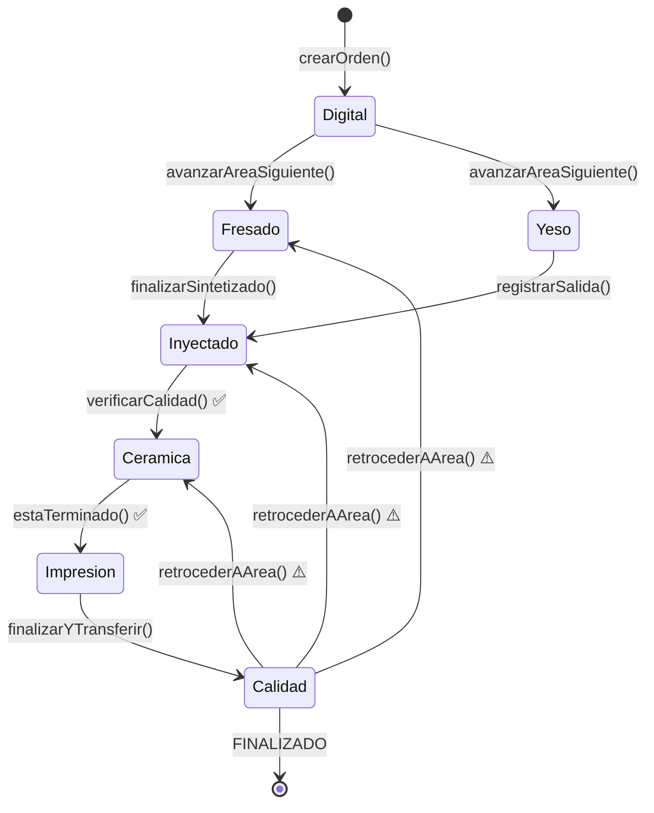

# 📊 Diagrama de Clases — HIKMADENT Backend
> Generado desde el código fuente PHP. Visualiza en: **VS Code** (extensión Markdown Preview Mermaid), **GitHub** (renderiza automáticamente), **mermaid.live**

---

## 🏗️ Arquitectura Global

---

## 🔄 Máquina de Estados — OrdenTrabajo

---

## 📦 Diagrama de Clases Completo

```mermaid
classDiagram
    %% ─── CONTRATOS ────────────────────────────────────────────────
    class IProcesable {
        <<interface>>
        +iniciarProceso(ordenId, operadorId) bool
        +finalizarProceso(ordenId, operadorId) bool
        +validarCalidad(ordenId) bool
        +getNombreArea() string
    }

    class IObservable {
        <<interface>>
        +suscribir(evento, observador) void
        +disparar(evento, datos) void
    }

    %% ─── ENUMS ────────────────────────────────────────────────────
    class AreaType {
        <<enumeration>>
        DIGITAL
        FRESADO
        YESO
        INYECTADO
        CERAMICA
        IMPRESION
        CALIDAD
        +transicionesPermitidas() array
        +retrocesosPermitidos() array
    }

    class OrderStatus {
        <<enumeration>>
        PENDIENTE
        EN_PROCESO
        EN_ESPERA
        COMPLETADO
        CON_ERROR
        RETROCEDIDO
        FINALIZADO
        +label() string
    }

    class MaterialType {
        <<enumeration>>
        ZIRCONIO
        PMMA
        RESINA
        CERAMICA
        YESO
        +requiereSintetizado() bool
        +esFresablePorPMMA() bool
    }

    class PriorityLevel {
        <<enumeration>>
        URGENTE
        NORMAL
        RETRASADO
        +peso() int
    }

    %% ─── MODELO CENTRAL ───────────────────────────────────────────
    class OrdenTrabajo {
        -int idOrden
        -DateTime fechaIngreso
        -string tipoEntrada
        -OrderStatus estado
        -AreaType areaActual
        -array historialTransiciones
        -array detallesTecnicos
        +cambiarArea(nuevaArea, operadorId) void
        +actualizarEstado(nuevoEstado) void
        +agregarDetalleTecnico(area, detalle) void
        +detallesTecnicosComoJson() string
        +resumen() string
    }
    OrdenTrabajo --> AreaType
    OrdenTrabajo --> OrderStatus

    %% ─── ADMINISTRACION ───────────────────────────────────────────
    class ClienteDoctor {
        -int idDoctor
        -string nombre
        -string clinica
        -string telefono
        -string email
    }

    class Paciente {
        -int idPaciente
        -string nombre
        -int edad
        -string observaciones
    }

    class DisenoExocad {
        -string nombreArchivo
        -float tiempoDiseno
        -string versionSoftware
        -string rutaArchivo
        +vincularArchivo(ruta) void
    }

    ClienteDoctor "1" --> "*" OrdenTrabajo : solicita
    Paciente "1" --> "*" OrdenTrabajo : tiene
    OrdenTrabajo "1" --> "1" DisenoExocad : vincula

    %% ─── ÁREA DENTAL ──────────────────────────────────────────────
    class PiezaDental {
        -int id
        -string tipoDiseño
        -DateTime fechaIngreso
        -bool procesoCeramicoIniciado
        +iniciarProcesoCeramico() void
    }

    class Maquillaje {
        -string tipo
        -int tiempoEstimado
        -bool completado
        +completarMaquillaje() void
    }

    class Ajuste {
        -bool formaAdaptacion
        -bool texturaAltura
        +validarCalidad() bool
    }

    class RegistroIncidencia {
        -int idOrden
        -string problema
        -AreaType areaRetroceso
        -int operadorId
        -DateTime fechaRegistro
        +retornarAAdaptacion() array
    }

    PiezaDental --> Maquillaje : pasa a
    Maquillaje --> Ajuste : requiere
    Ajuste --> RegistroIncidencia : si falla calidad
    RegistroIncidencia --> AreaType

    %% ─── ÁREA FRESADO ─────────────────────────────────────────────
    class TrabajoFresado {
        -int idTrabajo
        -string archivoDiseno
        -MaterialType materialSeleccionado
        -bool cargaIniciada
        +asignarMaquina(maquina) void
        +iniciarCarga() void
        +finalizarSintetizado() void
    }

    class Maquina {
        -string nombre
        -bool aceptaZirconio
        -bool aceptaPMMA
        -bool enUso
        +verificarDisponibilidad(material) bool
        +ocupar() void
        +liberar() void
    }

    class Inventario {
        -array stock
        +verificarStock(material, cantidad) bool
        +descontarStock(material, cantidad) void
        +getCantidadDisponible(material) int
    }

    TrabajoFresado --> Maquina : asignado a
    TrabajoFresado --> Inventario : consume
    TrabajoFresado --> MaterialType

    %% ─── ÁREA INYECTADO ───────────────────────────────────────────
    class ProcesoInyectado {
        -int ordenId
        -MaterialType material
        -array fasesRegistradas
        +registrarFase(nombreFase) void
        +verificarCalidad() bool
        +comoDetalleTecnico() array
    }

    class FaseTermica {
        -float temperaturaInicial
        -float temperaturaMaxima
        -int tiempoMinutos
        +validarCurvaCalor() bool
        +comoArray() array
    }

    class AjusteAdaptacion {
        -bool escaneoIntraoralOk
        -bool ajusteOclusalOk
        +ValidarEscaneoIntraoral() bool
        +finalizarOrden() bool
    }

    ProcesoInyectado *-- FaseTermica
    ProcesoInyectado *-- AjusteAdaptacion

    %% ─── ÁREA YESO ────────────────────────────────────────────────
    class AreaYeso {
        -int idProceso
        -string materialBase
        -DateTime horaSecado
        -bool salidaRegistrada
        +registrarSalida() void
        +comoDetalleTecnico() array
    }

    class MaterialYeso {
        -MaterialType nombre
        -float cantidadGramosMl
        -bool requiereSintetizado
    }

    AreaYeso "1" --> "1" MaterialYeso : utiliza

    %% ─── ÁREA CERÁMICA ────────────────────────────────────────────
    class OrdenImpresion {
        -int idOrden
        -DateTime fechaRecepcion
        -EstadoCeramica estado
        -array erroresRegistrados
        +registrarError(tipoError) void
        +actualizarEstado() void
        +estaTerminado() bool
    }

    class PostProcesado {
        -int tiempoLavado
        -int tiempoFotocurado
        -float temperatura
        +validarProceso() bool
        +comoArray() array
    }

    class ControlMantenimiento {
        -DateTime ultimaLimpieza
        -int totalImpresiones
        +notificarMantenimiento() bool
        +registrarLimpieza() void
        +registrarImpresion() void
    }

    OrdenImpresion "1" --> "1" PostProcesado
    OrdenImpresion "*" --> "1" ControlMantenimiento : afecta a

    %% ─── ÁREA IMPRESIÓN ───────────────────────────────────────────
    class ModuloImpresion {
        -int idRecepcion
        -bool impresionValida
        -string tipoYeso
        -DateTime inicioFraguado
        -array excepciones
        +registrarExcepcion(descripcion) void
        +consultarPrioridadEnCola() array
        +finalizarYTransferir() array
    }

    class GestionPrioridad {
        -PriorityLevel nivel
        -array cola
        +agregarOrdenACola(ordenId) void
        +calcularOrdenCola() array
    }

    class TransferenciaArea {
        -string areaDestino
        -DateTime horaTransferencia
        -bool notificacionEnviada
        +notificarSiguienteEstacion(ordenId) array
    }

    ModuloImpresion --> GestionPrioridad : consulta
    ModuloImpresion --> TransferenciaArea : finaliza con

    %% ─── SERVICIOS ────────────────────────────────────────────────
    class WorkflowManager {
        -array observadores
        -array ordenesActivas
        +suscribir(evento, observador) void
        +disparar(evento, datos) void
        +registrarOrden(orden) void
        +avanzarAreaSiguiente(ordenId, areaDestino, operadorId) bool
        +retrocederAArea(ordenId, areaRetroceso, operadorId, motivo) bool
    }

    class EfficiencyReportService {
        -AuditLogger auditLogger
        +GetEfficiencyReport() array
    }

    WorkflowManager ..|> IObservable
    WorkflowManager --> OrdenTrabajo : gestiona
    EfficiencyReportService --> AuditLogger : lee

    %% ─── OBSERVERS ────────────────────────────────────────────────
    class AuditLogger {
        -array registros
        +manejarEvento(datos) void
        +getRegistros() array
        +exportarComoJson() string
        +filtrarPorOrden(ordenId) array
    }

    class NotificacionTecnico {
        -array notificacionesEnviadas
        -array mapaEventos
        +manejarEvento(datos) void
        +getNotificacionesEnviadas() array
    }

    WorkflowManager --> AuditLogger : notifica
    WorkflowManager --> NotificacionTecnico : notifica

    %% ─── PROCESSES ────────────────────────────────────────────────
    class ProcesoDental {
        +iniciarProceso(ordenId, operadorId) bool
        +finalizarProceso(ordenId, operadorId) bool
        +validarCalidad(ordenId) bool
        +getNombreArea() string
    }

    class ProcesoFresado {
        -Maquina maquina
        -Inventario inventario
        -int cantidadMaterialRequerida
        +iniciarProceso(ordenId, operadorId) bool
        +finalizarProceso(ordenId, operadorId) bool
        +validarCalidad(ordenId) bool
    }

    class ProcesoAreaInyectado {
        +iniciarProceso(ordenId, operadorId) bool
        +finalizarProceso(ordenId, operadorId) bool
        +validarCalidad(ordenId) bool
    }

    ProcesoDental ..|> IProcesable
    ProcesoFresado ..|> IProcesable
    ProcesoAreaInyectado ..|> IProcesable
    ProcesoCeramica ..|> IProcesable
    ProcesoYeso ..|> IProcesable
    ProcesoImpresion ..|> IProcesable

    ProcesoFresado --> Maquina
    ProcesoFresado --> Inventario
```

---

## 🔗 Herramientas para visualizar este archivo

| Herramienta | Cómo usarla | Ventaja |
|---|---|---|
| **GitHub** | Sube el archivo — renderiza automáticamente | Ya lo tienes online |
| **mermaid.live** | Copia el bloque `mermaid` y pégalo | Sin instalación |
| **VS Code** | Instala `Markdown Preview Mermaid Support` | Visualización local |
| **PhpStorm** | Plugin `PHP Class Diagrams` | Genera desde el código PHP |
| **Diagrams.net** | Importa el Mermaid desde Extras > Edit Diagram | Exporta a PNG/SVG |
