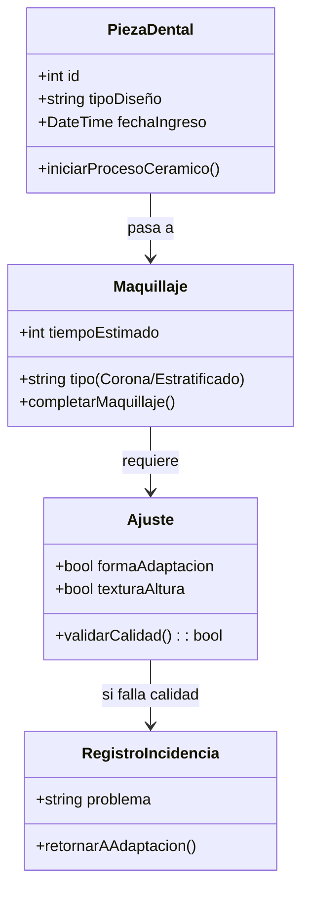
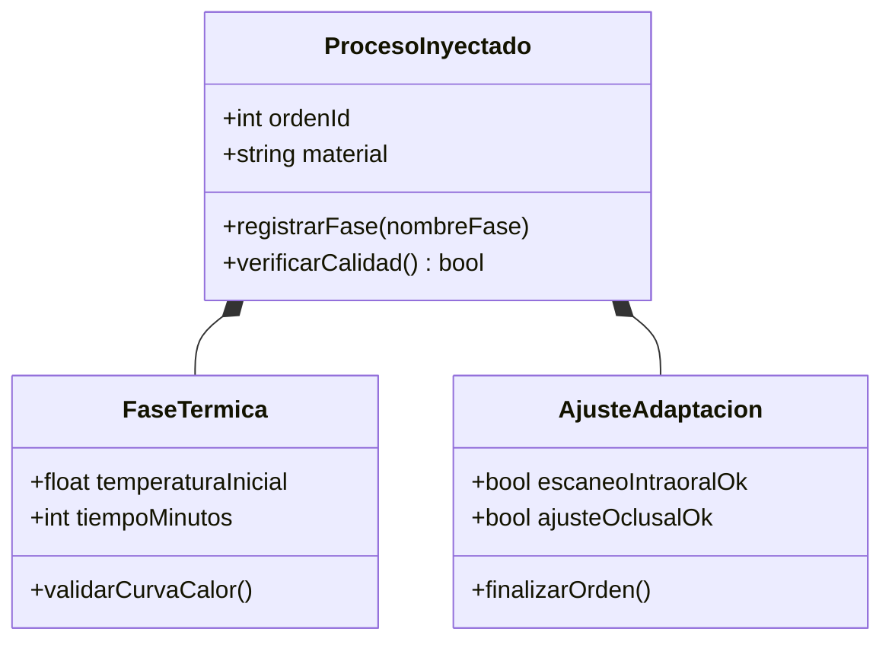
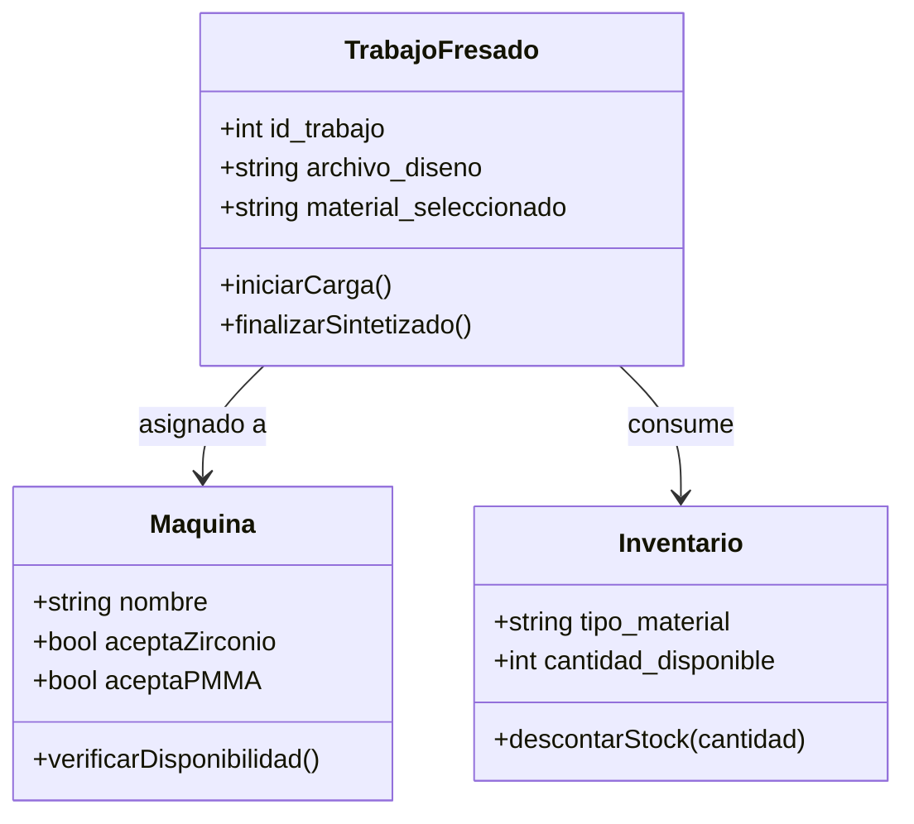
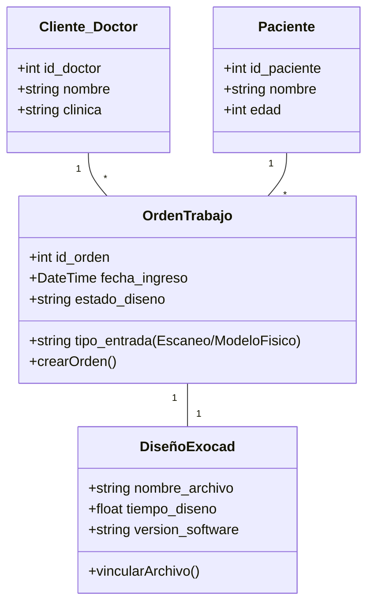
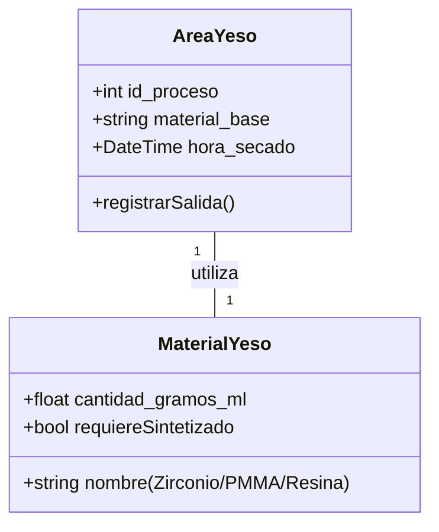
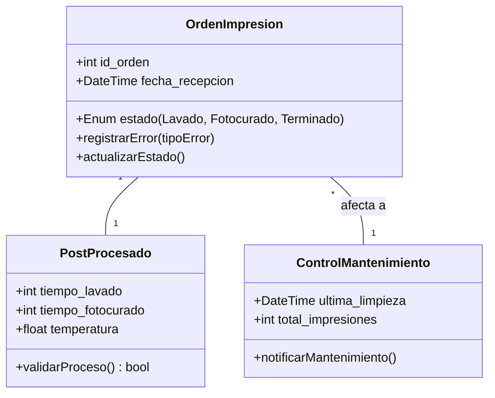
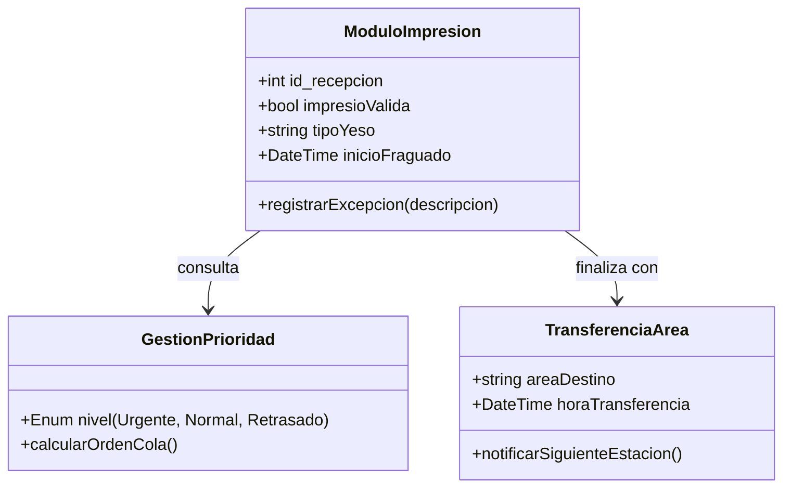

# Descripción Técnica para el Prompt de Generación de IA

Para que la IA genere el código backend correctamente para el sistema **Hokma Dent**, copia y pega el siguiente prompt:

---

## PROMPT DE GENERACIÓN DE CÓDIGO:

"Actúa como un Arquitecto de Software Senior. Genera el código backend (en Laravel 11 o ASP.NET Core 8) para un sistema de Laboratorio Dental llamado **'Hokma Dent'**.

### REQUERIMIENTOS ARQUITECTÓNICOS:

- **SOLID:** Usa Interfaces para los procesos de manufactura e inyección de dependencias para los servicios de cada área (Digital, Fresado, Inyectado, Cerámica).
- **CLEAN CODE:** Nombres de métodos descriptivos (`IniciarProcesoDeSintetizado`, `ValidarEscaneoIntraoral`). Usa tipos fuertemente tipados (Enums para materiales y estados).
- **TRAZABILIDAD (BI):** Cada cambio de área debe disparar un evento que registre el Timestamp y el OperadorId en una tabla de auditoría para análisis de Business Intelligence.
- **FLUJO DE TRABAJO:** Implementa una máquina de estados para la `OrdenTrabajo` que siga este flujo: Digital -> (Fresado/Yeso) -> Inyectado -> Cerámica -> Calidad.
- **REGLAS DE NEGOCIO:**
    - Si el `AreaCalidad` detecta un error, debe permitir el retroceso a un área específica (`RegistroIncidencia`).
    - El área de Fresado debe validar disponibilidad de `Maquina` y `Stock` antes de iniciar.

### PASOS DE IMPLEMENTACIÓN:

1. **Capa de Datos:** Crear una tabla `Ordenes` con un campo JSON o tablas relacionadas para los detalles técnicos de cada área (temperaturas, tiempos de fraguado).
2. **Capa de Servicios:** Crear un `WorkflowManager` que sea el único encargado de mover la orden de una estación a otra. Esto evita que las áreas estén "pegadas" entre sí (bajo acoplamiento).
3. **Capa de Notificaciones:** Implementar un sistema de observadores (Observer Pattern) para que cuando una pieza termine en "Fresado", le llegue una notificación al técnico de "Inyectado" automáticamente.
4. **Dashboards BI:** El código debe incluir una función `GetEfficiencyReport()` que calcule el tiempo promedio que cada orden pasa en cada una de las interfaces `IProcesable`.

Este enfoque garantiza una calificación excelente en arquitectura de software, permitiendo el crecimiento del sistema (ej. agregar un área de Ortodoncia implementando `IProcesable` sin romper lo existente).

### DIAGRAMAS DE CLASES DE REFERENCIA:

#### ## DENTAL

#### ## INYECTADO

#### ## FRESADO

#### ## ADMINISTRACION

#### ## YESO

#### ## CERAMICA

#### ## IMPRESION

"
---
